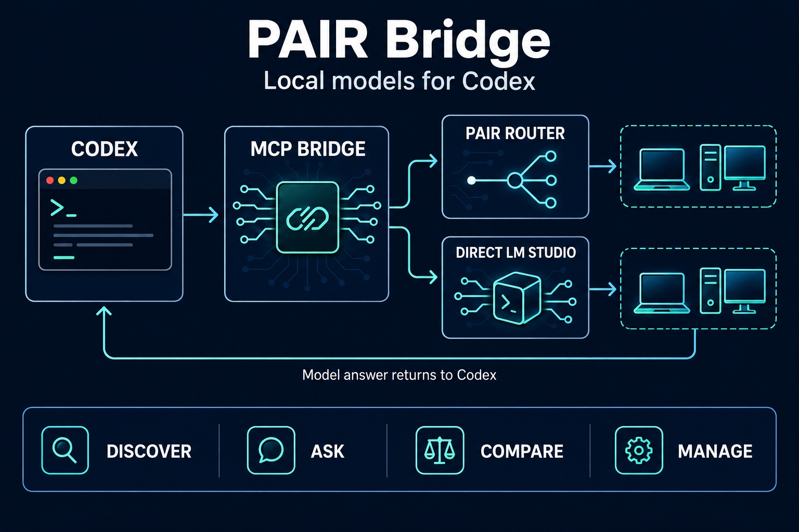

<div align="center">

# Codex PAIR Bridge

### /pair: manage models on your devices (0.4.0)

Type `/pair` and select the **pair** skill in Codex's slash menu, or mention `$pair`. Start a new task after installing the update. Astra, Sol, and other tool-capable Codex models can use the same skill.

- `/pair` — inspect the routing catalog and configured devices without changing models.
- `/pair load an installed model on pc and ask it to review this function` — inspect, select, load, then query the exact device.
- `/pair unload the model you loaded for this task` — free that instance's memory, keeping weights on disk.

Configure **native LM Studio API origins**, not PAIR proxy URLs, in `~/.codex-pair-bridge.json`:

```json
{
  "base_url": "http://127.0.0.1:1234/v1",
  "devices": [
    {"id": "mac", "engine": "lmstudio", "base_url": "http://127.0.0.1:1235"},
    {"id": "pc", "engine": "lmstudio", "base_url": "http://127.0.0.1:1235", "ssh_host": "my-pc"}
  ]
}
```

Ports above are examples. Copy the actual native LM Studio endpoint on each machine. LM Studio's `/api/v1/models`, `/load`, and `/unload` support is required (0.4+). Devices are explicitly configured: the bridge does not automatically gain management access to every PAIR peer. Any number of configured devices can be inspected; unreachable ones are reported individually. Ollama management, downloading/deleting weights, and engine/cluster administration are not implemented.

For remote devices, `ssh_host` names an existing OpenSSH config alias. The bridge creates a temporary loopback-only SSH tunnel with host-key checking and batch authentication, then closes it. No remote shell command is run and no public engine port is opened. Configure and verify SSH normally before using the plugin. Direct HTTPS endpoints are also supported. For authenticated engines set `api_key_env` to your token's environment-variable name and ensure that variable is passed to the MCP process (add its name to `.mcp.json` `env_vars` if necessary); never put tokens in prompts.

| Tool | Purpose |
| --- | --- |
| `pair_devices()` | Live installed/loaded inventory for configured devices. |
| `pair_list(device="pc")` | Native model keys, types, sizes, context limits, loaded instance IDs. |
| `pair_load(device, model, context_length=8192)` | Load an installed model; reuse existing instances. |
| `pair_unload(device, instance_id)` | Unload exactly one instance; keep model files. |
| `pair_ask(model, prompt, device="pc")` | Query that exact device's loaded LLM directly. |

Without `device`, `pair_list` and `pair_ask` retain their PAIR-router behavior. Device-targeted inference bypasses PAIR routing so a load on one machine is not followed by a query on another. The device form of `pair_ask` requires exactly one loaded instance of the selected key.

Load, unload, and inference share a lock on this client machine; other users and applications are outside that lock. Unloading can disrupt their work. Engine auto-eviction remains in effect. A timeout may leave an operation running; inspect state instead of automatically retrying. `not_confirmed` means the requested state was not observed.

## Your local models, one conversation with Codex.

[English](README.md) · [Русский](README.ru.md) · [Installation](#get-started) · [Troubleshooting](#troubleshooting)



[](https://github.com/GermanMik/codex-pair-bridge/actions/workflows/test.yml)
[](LICENSE)

</div>

Ask a local model for a code review, a second opinion, or an alternative solution—without leaving your Codex task. **Codex PAIR Bridge gives Codex tools for consulting PAIR and managing configured LM Studio devices.**

Independent community project. Not affiliated with or endorsed by OpenAI or NVIDIA.

## What does MCP actually do?

**MCP means Model Context Protocol.** It is the interface through which Codex discovers tools and calls them. In this project, a small MCP server runs on your computer and exposes tools for discovery, model lifecycle, and inference.

Think of the workflow as four jobs:

| Component | Its job | Example |
| --- | --- | --- |
| **Codex** | Understand your task and use the returned answer. | “I need a second opinion on this function.” |
| **MCP bridge** | Make model access available as tools. | Call `pair_ask` with a model ID and text. |
| **PAIR** | Route the request to the selected model. | Send the request to a connected model server. |
| **Local model** | Generate an answer. | Return review comments to Codex. |

**MCP is the tool connection; PAIR is the model router.** The bridge does not turn a local model into the main Codex model. Codex continues coordinating your task, and the consulted model returns text for Codex to assess.

## A real example

> **You:** “Use `pair_list`, then `pair_ask` to review this function for edge cases.”
>
> **Codex:** Reads the current model list, selects an appropriate chat model, and sends the relevant code through the bridge.
>
> **Local model:** Returns its review.
>
> **Codex:** Checks the suggestions against your code and explains which changes are worth making.

The consulted model receives the text passed to the tool. This bridge gives it no shell tools or direct access to your files.

## Get started

### 1 · Prepare your local models

You need:

- **Codex** with plugin marketplace support.
- **[uv](https://docs.astral.sh/uv/getting-started/installation/)** installed and available on your PATH.
- **PAIR running**, connected to a model server with at least one working chat model.

After installing uv, restart Codex so it can discover it. Confirm uv is available with `uv --version`.

### 2 · Install the plugin

Run these commands in a terminal:

```sh
codex plugin marketplace add GermanMik/codex-pair-bridge
codex plugin add codex-pair-bridge@codex-pair-bridge
```

This adds our GitHub marketplace to Codex. It is a community catalog, separate from OpenAI's universal plugin directory. [About plugin marketplaces](https://developers.openai.com/plugins/build/plugins).

The first tool launch downloads the locked dependencies and, if needed, a compatible Python runtime. Subsequent launches reuse the cache.

### 3 · Start a new Codex task

Write:

> Use `pair_list` to show the available models.

Then use an **exact model ID** from that list:

> Use `pair_ask` with model `<model ID>` to explain this function and check its edge cases.

You should get a model answer that Codex can use in the conversation. The model list alone does not confirm that every listed model can load successfully.

## Prompts to try

| Goal | Ask Codex |
| --- | --- |
| Discover models | “Use `pair_list` to show the available models.” |
| Review code | “Use `pair_ask` with `<model ID>` to review this code for bugs.” |
| Get another approach | “Use `pair_ask` to ask a model from `pair_list` for an alternative, then evaluate it.” |
| Compare answers | “Use `pair_list`, then `pair_ask` for two chat models sequentially and compare.” |

Replace `<model ID>` with a name from the current catalog. Model names differ between installations.

## Connect your PAIR router

The default address is **`http://127.0.0.1:1234/v1`**. This is the PAIR proxy in the tested setup. Check the endpoint displayed by your PAIR installation if it uses a different port.

To change it, create **`.codex-pair-bridge.json` in your home directory**:

```json
{
  "base_url": "http://127.0.0.1:1234/v1"
}
```

| System | Configuration file |
| --- | --- |
| macOS / Linux | `~/.codex-pair-bridge.json` |
| Windows | `%USERPROFILE%\.codex-pair-bridge.json` |

Use your **PAIR router's endpoint**. An individual LM Studio endpoint only provides that server's models. `127.0.0.1` refers to the computer running the bridge.

<details>
<summary><strong>Environment variables and authentication</strong></summary>

`PAIR_BASE_URL` overrides the configuration file. Set it in the environment inherited by Codex.

If your endpoint requires a bearer token, set `PAIR_API_KEY` in that environment. Credentials must not be embedded in the URL or committed to the repository.

</details>

## What stays local?

The bridge runs on your computer and sends requests to **your configured PAIR endpoint**. PAIR can route them to your connected model servers. The project maintainer receives no requests through this plugin.

**The complete Codex conversation is not necessarily local.** Model answers return to Codex and follow your Codex/OpenAI data settings. PAIR and model servers may also keep their own logs. [Read the privacy note](PRIVACY.md).

## Troubleshooting

| What you see | What to check |
| --- | --- |
| Tools do not appear | Open a new task; verify the plugin is enabled and `uv` is on Codex's PATH. |
| Cannot reach PAIR | Start PAIR and check its endpoint against the configuration file. |
| A model is listed but fails | Inspect PAIR's job details and model-server logs. Catalog entries are not health checks. |
| HTTP 400 or 500 | Check the exact model ID, model loading, memory availability, and server errors. |
| Another request is running | Wait for the current bridge call to finish. |
| Timeout | Check PAIR before retrying: the model job may still be running. |
| No final text | The model may have spent its output budget on reasoning; inspect the result before choosing a larger budget. |

## Router commands

These are **MCP tool names used inside Codex**, not terminal commands or slash commands. You can mention them in your message; Codex supplies their structured arguments.

**`pair_list`** — without arguments, returns the PAIR routing catalog. With `device`, returns native device inventory.

**`pair_ask`** — requires `model` (an exact ID from `pair_list`) and `prompt` (your question). Optional `max_tokens` defaults to `2048`.

Example arguments for `pair_ask` (replace the model ID):

```json
{
  "model": "<exact ID from pair_list>",
  "prompt": "Review this function for edge cases: ...",
  "max_tokens": 2048
}
```

## Tool reference

| Tool | Inputs | Returns |
| --- | --- | --- |
| `pair_list` | None | Current model IDs and inferred type hints. |
| `pair_ask` | `model`, `prompt`, optional `max_tokens` | Answer, reported model ID, completion status, elapsed time and usage when supplied by the server. |

<details>
<summary><strong>Limits and request behavior</strong></summary>

- Exact model IDs only; the catalog is refreshed before inference.
- Likely embedding and draft models are rejected for chat. Type hints are inferred from names.
- One inference at a time across this user's bridge processes. Other applications are outside this limit.
- No automatic retries, fallback models, or model downloads. The engine may load an already installed model and consume GPU/RAM.
- Default output budget: 2,048 tokens; allowed range: 32–8,192. Input: up to 48,000 characters. Model context limits still apply.
- Request timeout: 180 seconds. Cancellation or timeout does not guarantee cancellation of the upstream model job.
- Empty final answers are errors. Answers stopped by the output budget are marked as truncated.
- The bridge does not change persistent engine settings or repair model catalogs. Explicit loads can set context length.

</details>

## Update from an earlier version

```sh
codex plugin marketplace upgrade codex-pair-bridge
codex plugin add codex-pair-bridge@codex-pair-bridge
```

Open a new task after updating. Version 0.3.0 shortens the tools to **`pair_list`** and **`pair_ask`**; update any saved prompts that use the old names.

## For contributors

```sh
cd plugins/codex-pair-bridge
uv run --locked --script ./scripts/server.py --self-test
```

Tests cover MCP initialization, argument validation, configuration, errors, timeouts, locking and response parsing. CI runs on **macOS, Windows and Linux**. Real PAIR requests have also been tested from macOS with local Ornith and Qwen on a Windows node; this does not certify every model/server combination.

Dependencies are locked in `scripts/server.py.lock`. Update intentionally with `uv lock --script scripts/server.py`, then rerun tests.

<details>
<summary><strong>Uninstall</strong></summary>

```sh
codex plugin remove codex-pair-bridge@codex-pair-bridge
codex plugin marketplace remove codex-pair-bridge
```

</details>

---

[Report an issue](https://github.com/GermanMik/codex-pair-bridge/issues) · [Privacy](PRIVACY.md) · [Security](SECURITY.md) · [MIT license](LICENSE)
